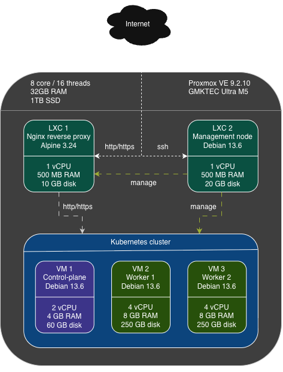
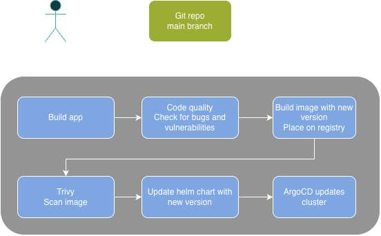

# Introduction

When I started working, I got my first experience on creating a CICD pipeline and that was something I really enjoyed doing it. Because of that I started to steer my professional career towards DevOps. I learned a bit about everything that surrounds it, from CICD, IaC, monitoring, managing clusters, networking and so on. But no matter what, there is always some new tool, or old tool that I never got the opportunity to work with, that I should know as DevOps.

Because of that I started to wonder what I could do to learn those tools in a safe environment, but also one that looks semi-professional and simulates a real environment instead of just creating Docker containers or installing MiniKube on my own machine. I thought about doing that on AWS, but cloud providers have a problem, which is that it costs money, and even if I try to go with free tiers or always free options and set budgets, eventually I could make a mistake that could cost me a lot of money, and I cannot afford that. So the only viable option I thought of is to create a homelab. That way, outside of electric bill, I can have full control of everything, hardware costs and software I use.

As the price of computer components are increasing almost every month, I cannot afford to buy a few servers to build the homelab, so I decided to buy just one and start from there. Because I want to create a few VMs and want to play around with Kubernetes and multiple containers, I bought a miniPC called "GMKtec Ultra M5" with 8 cores, 16GB RAM and 500GB, although I decided to later on upgrade to 32 GB RAM and an additional 1 TB SSD just to have a bit more room to work with.

 You can check the price of the miniPC on [Amazon ES](https://www.amazon.es/dp/B0DJLWC2N9/ref=syn_sd_onsite_desktop_0?ie=UTF8&pf_rd_p=7667d0f1-4fc1-455f-8b79-c20b24927948&pf_rd_r=5QX7KKJW78QQSGV2VGB3&pd_rd_wg=HyGQe&pd_rd_w=7rqgL&pd_rd_r=83e0be91-41fc-45fd-84ab-f644b16e9075&aref=rLOcv1IcXC&th=1).

The final spec is this:

- Ryzen 7 7730U which has 8 cores / 16 threads
- 32 GB RAM
- 1 TB SSD for Proxmox
- 500 GB SSD for Windows, which is not relevant for this homelab

# Architecture

So what I'm trying to achieve here is to have a workflow and a system to host, deploy, monitor and manage my applications. Meaning that I will have to have at least a kubernetes cluster, git server, registry for container images, secrets manager, code quality and vulnerability scanner, ci/cd, monitoring and alerting. I will not have backups set up as I don't have more SSD or a NAS server available, but if I had, I would set that up as well.

Since I am using only one machine, I need a way to create virtual machines. For that I decided to use Proxmox, which is free and open-source and is highly recommended online. I will use it to instantiate three VMs to be my Kubernetes cluster and also two LXC containers, one to be used as a reverse proxy, so I don't expose the cluster directly and the other to be like a jumpbox, where I will have installed git, kubectl, helm, OpenTofu, Ansible and Argocd cli to easily manage the cluster without needing to install these tools on whatever computer I am on.

## High level architecture

Here's the high level architecture of the homelab:

As it is possible to see on the image, the total vCPUs used are 12, the total of RAM is 21 GB and the maximum storage used is 590 GB, which leaves 4 vCPUs, 11 GB RAM and 410 GB free space to be used by Proxmox itself or so I can use to experiment some new VM or LXC.

## Network

As far as networking, this is the table with the IPs I reserved on the router for each VM and LXC.

| What                             | MAC                  | IP              |
| -------------------------------- | -------------------- | --------------- |
| **Proxmox/MiniPC**               | -                    | -               |
| └─ nic0                          | `xx:xx:xx:xx:xx:xx`  | `192.168.1.70`  |
| └─ nic1                          | `yy:yy:yy:yy:yy:yy`  | `192.168.1.71`  |
| **LXC**                          | -                    | -               |
| └─ management-node               | `02:00:00:00:01:a1`  | `192.168.1.80`  |
| └─ reverse-proxy-01              | `02:00:00:00:01:a2`  | `192.168.1.81`  |
| **VM**                           | -                    | -               |
| └─ k3s-cp01                      | `02:00:00:00:02:a1`  | `192.168.1.100`  |
| └─ k3s-wk01                      | `02:00:00:00:02:a2`  | `192.168.1.101`  |
| └─ k3s-wk02                      | `02:00:00:00:02:a3`  | `192.168.1.102`  |

There are two nic, because the miniPC has two ethernet ports. I placed xx and yy on MAC because it is not relevant for this homelab. The other ones start with 02, because it is a locally managed MAC prefix, which is useful when creating VMs and LXCs, to avoid using a real MAC address. Feel free to use other values or let Proxmox generate one and then adapting the reserved IPs on the router to match the generated MAC.

### Who or what can connect where

One thing I want to do is restrict access to the VMs and LXCs, so not everything can connect to everything. On the [high level architecture](#high-level-architecture) diagram it is possible to see the allowed connections, but heres another way of describing it:

User can:
- SSH into management-node to manage everything
- Connect to Proxmox through web UI
- Connect to reverse proxy with HTTP and HTTPS

Management-node can:
- SSH into k3s nodes, VMs and LXCs
- SSH into Proxmox

The reverse proxy:
- redirects HTTP and HTTPS to Kubernetes

Kubernetes nodes:
- Can only communicate with other k3s nodes

## CI/CD

I will implement a CI/CD workflow like the following:

One thing I want to address is that in a real company with multiple environments, for example, dev, staging and prod, this pipeline would need to be adapted. For example, no one should be able to commit directly to main branch and only through pull requests. The environments would be separated, meaning it could probably have separate branches for each stage and would also need a rollback strategy. But it's a good start for a homelab.

## Tech stack and why

So the homelab has two purposes:
- The first is of course learn any tool I want related to DevOps, for example a new monitoring tool appears and I want to play around to experiment.
- The second is to leverage that system and create whatever application I want and make it run there as well, so I cannot fill all the resources and leave some room for my applications.

For most categories, I want to try out and compare at least two applications and decide which I will end up using. I will compare not only how much resources they consume and time to do certain tasks, but also which I like using more.

### Virtualization

I used Proxmox. The main reasons are it is free and open-source, it is widely recommended for homelabs, it can do VMs and LXC, which is a lightweight alternative to VMs.

### Source control (to store repositories):

 - Gitlab
    - It is a complete package, it has git, can do CICD, has a registry and a lot of features.
    - Because of that is is also very heavy, consumes a lot of resources. I will try to use a stripped version as I will only need it to be a repository and maybe the registry and/or CI.
 - Gitea
    - It consumes less resources and has what I need, which is being a repository, contains a registry and can do CI as well.

### Image registry (to store container images):
 - Harbor
   - Besides being a registry, it can also scan the images for vulnerabilities and access control
 - Gitlab registry
   - If I use Gitlab, it can contain the registry as well
 - Gitea registry
   - Same reason as Gitlab, if I use Gitea, why not use the registry as well

### Secrets (To have the secrets available to the cluster and possibly other applications):
 - Hashicorp Vault
   - Very complete package, it is used by a lot of companies, but some features are hidden behind a enterprise license. Since I just want to store credentials and don't need all the features, like the namespaces, it should be fine.
 - OpenBao
   - It is a fork of Hashicorp Vault. It doesn't have all the features of Vault yet, although there is a roadmap where they plan on implement some missing features.

### CI (Continuous integration, so when a new commit is done on the repos, the workflow runs):
 - Jenkins
   - Industry standard, has a lot of plugins and very good for CICD.
 - Gitlab CI/Runners
   - If using Gitlab, why not use runners to do CI?
 - Gitea CI
   - Same reason, compare performance and resource consumption between Jenkins and Gitea CI.

### Code quality and security scans (To scan for issues or vulnerabilities on the code):
 - Sonarqube
   - Scans the code for bugs, code smells and technical debt.
 - Trivy
   - Scans images for vulnerabilities.
 - Semgrep
   - Scans for security vulnerabilities.

### CD (Continuous deployment, to deploy new versions of the applications):
 - ArgoCD
   - GitOps tool to deploy to kubernetes based on the repositories.

### Observability (To monitor the cluster and proxmox):
 - Prometheus and Grafana
   - Prometheus gathers various metrics from the cluster, for example cpu and memory of each pod.
   - Grafana is a visualization tool.
 - Loki
   - Loki is a log aggregator.
 - Jaegar
   - Jaegar is used for tracing.
 - SigNoz
   - SigNoz is a complete package that does all of the above.

### Alerting:
 - AlertManager
   - Used to send alerts based on the metrics of Observability.

# Next steps

Now that it is possible to understand what I want to do and a high level view of the architecture of the homelab, we can start actually building it. On the next chapter, [2 - Install Proxmox](./2-Install_proxmox.md), we will install Proxmox on the Mini PC and set up the network configuration.

# Articles:

Heres the full list of articles of this series:

 - [1 - Architecture and Hardware](./1-Architecture_and_hardware.md)
 - [2 - Install Proxmox](./2-Install_proxmox.md)
 - [3 - Create and configure LXCs](./3-Create_and_conf_LXCs.md)
 - [4 - Create and configure VMs](./4-Create_and_conf_VMs.md)
 - [5 - Git: Gitlab vs Gitea](./5-Git_gitlab_vs_gitea.md)
 - [6 - Deploy ArgoCD](./6-deploy_argocd.md)