# Introduction

On [first part of this series](./1-Architecture_and_hardware.md), it was described the hardware, the high level architecture of the homelab, the network, and the tech stack. Now it is time to actually make it work. On this second part, it will be described how I installed Proxmox on the mini PC and the initial setup to prepare it to create the VMs and LXCs.

# Pre requisites - Static IPs

Before installing Proxmox, it is best to configure a static IP address on the router, so the miniPC and all the VMs and LXCs will have always the same IP, regardless of reboots or network changes.
For that, on the DHCP configuration of the router, I created IP reservations for the future VMs and LXC, and the Proxmox host itself. Check the [previous article](./1-Architecture_and_hardware.md#network) for the network diagram to see which IPs I used. For example, I set up the IP of the MiniPC as 192.168.1.71, but it can be any IP as long as it respects the network configurations.

# Installing Proxmox

To install proxmox, you can follow the [official guide](https://www.proxmox.com/en/products/proxmox-virtual-environment/get-started), but basically what it tells to do is to download the ISO file, use a tool like [Rufus](https://rufus.ie/) to create a bootable USB drive and then boot the PC from it to install it. 

During the installation process, it asks for some configuration. I choose to install via GUI but there is a CLI version as well. Here's how I configured it, but adapt as see fit for each scenario or environment:


In here be carefull about the SSD choosen, as it will remove everything inside the SSD.

I don't worry about the options and filesystem type because I am just using this SSD for Proxmox, but if you have a different setup, it might be worth checking it out.

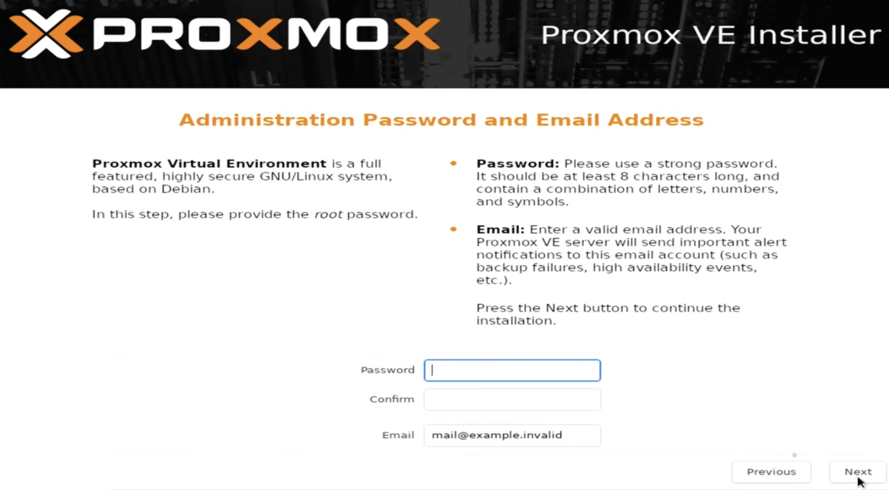

In here place a password for the root user.

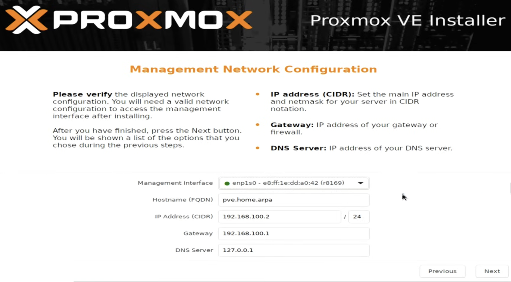

Here it asks to configure the network. For the management interface, choose the one that has the ethernet cable connected. Choose a hostname if you want, and place the IP (should be the static IP mentioned on [pre requisites](#pre-requisites---static-ips)), gateway and DNS server.

After that, it should start the installation. When complete, this should be visible:

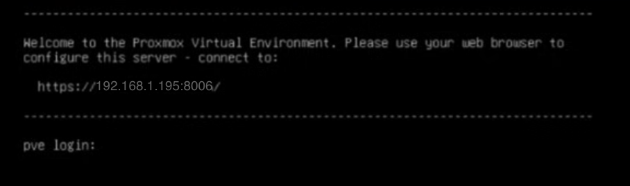

At this point, it should be possible to access the web interface by accessing to the URL mentioned (for example for me it is http://192.168.1.71:8006) on a browser from another computer on the same network. The browser may say it is an insecure connection, but that is normal since it is connecting through HTTP and not HTTPS and it is safe to access (Confirm the url though).

# Proxmox initial configuration

Before creating VMs or LXCs, I did some configurations. All this configurations can be done via web UI or using CLI.

Here's the list of changes I made next:

1. [Run Proxmox script to update repositories and disable enterprise repositories](#1---run-proxmox-script-to-update-repositories-and-disable-enterprise-repositories)
2. [Update Proxmox](#2---update-proxmox)
3. [Disable root login with password on console and access via SSH key](#3---disable-root-login-with-password-on-console-and-access-via-ssh-key)
4. [Create a proxmox user so it is not needed to access web UI with root](#4---create-a-proxmox-user-so-it-is-not-needed-to-access-web-ui-with-root)
5. [Create a terraform user and api token](#5---create-a-terraform-user-and-api-token)
6. [Prepare some ISOs and Templates](#6---prepare-some-isos-and-templates)

## 1 - Run proxmox script to update repositories and disable enterprise repositories

Once logged in, a pop up will appear indicating that there is no valid subscription. This is because we are using the community edition and not the enterprise edition. This is related to updates and we need to change from using the enterprise repositories to the comunity repositories. 

To do this, on the server view at the right, choose the node (for me it is pve01), then navigate to Updates -> Repositories. The menu will show a list of repositories from with it gets updates from. For the repositories that has enterprise on the components collumn, disable. Click on Add to add a repository and select the no-subscription option.

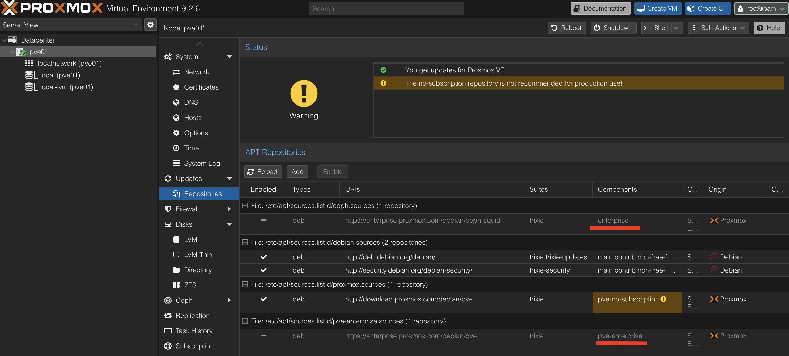

Via script:
 - The script is from this website: [Post-install script](https://community-scripts.org/scripts/post-pve-install
 - Access the node console by clicking on the node and then click on the shell button at the top or the shell option on the sidebar.

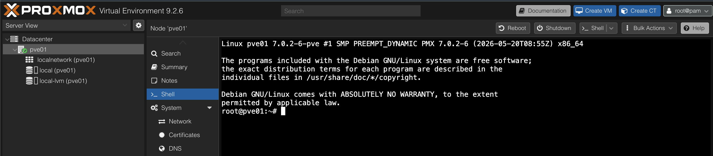

 - Run the command `bash -c "$(curl -fsSL https://raw.githubusercontent.com/community-scripts/ProxmoxVE/main/tools/pve/post-pve-install.sh)"`
 - During the process:
   - disable pve-enterprise and enable no-subscription repositories. The tests repository is optional, I didn't choose it.
   - You can disable the subscription pop up messages.
   - You can enable high availability if you want and have more nodes. I only have one node, so I can choose not to use it.
   - The Corosync is not necessary since I have only one node.
   - Update Proxmox.

## 2 - Update Proxmox

This may be optional since the previous step already updates Proxmox, but if you want to make sure, do it anyway.

Access the node console by clicking on the node and then click on the Console button at the top and run the commands:

- `apt get update`
- `apt get upgrade`

## 3 - Disable root login with password on console and access via SSH key

One thing I want to do is to not use the root account as much as I can. In a real environment, I would create a dedicated user and group with specific permissions, but since this is my personal homelab and only I will use it, I will just disable the root access via password when ssh, and require a ssh key.

To do this the first thing to do is create an ssh private and publc key. On windows, it is possible to do with PuttyGen, but I am on Linux, so the command to do this is `ssh-keygen -t ed25519 -C "someemail@thisisacomment.com"`. The -C and emals is optional, just a comment to identify the key, but it is good practice to add it, because it helps identifying who accessed and when. The -t is for the type of key, and ed25519 is a modern and secure algorithm.

When the command is run, it will ask a couple of questions. The file location and the pass, which is optional. Then on the file location it will appear two files, the private key, for example `abcd_key` and the public key `abcd_key.pub`.

The private key is the one to keep on the computer that will access via ssh. The public key needs to be placed on the proxmox server.

Access the node console by clicking on the node and then click on the Console button at the top.

1 - Copy the public key and place it on the file `/root/.ssh/authorized_keys`

2 - Disable root login via password by editing the file `/etc/ssh/sshd_config.d/hardening.conf` and adding the line `PermitRootLogin prohibit-password`
  - `nano /etc/ssh/sshd_config.d/hardening.conf`
  - add the line `PermitRootLogin prohibit-password`
  - save and exit and restart the ssh service `systemctl restart ssh`

If want to do it via script, here it is, just replace the ssh public key:
```bash
#!/bin/bash

# This script adds a ssh key to root and disable ssh with password
set -e

# Variables
SSH_PUBLIC_KEY="ssh-ed25519 aaaabbbbcccc myemail@some.com"

# Add ssh public key
mkdir -p /root/.ssh
echo "$SSH_PUBLIC_KEY" > /root/.ssh/authorized_keys
chmod 600 /root/.ssh/authorized_keys
chown -R root:root /root/.ssh

# No password login
cat > /etc/ssh/sshd_config.d/hardening.conf <<EOF
PermitRootLogin prohibit-password
EOF

sshd -t && systemctl restart ssh
```

Try to access from the computer that has the public key `ssh root@<IP_ADDRESS> -i <path_to_private_key>`

To avoid placing the -i and the IP on the command when I want to access the server, I added the IP and the path to the ssh key to the `~/.ssh/config` file.

```bash
Host homelab_proxmox
    HostName <IP_ADDRESS>
    User root
    IdentityFile <path_to_private_key>
```
Now the command to access it is just `ssh homelab_proxmox`.


## 4 - Create a proxmox user so it is not needed to access web UI with root

For the same reason as the previous point, I don't want to use the root account to access the web UI, because I wouldn't do it on a professional environment. I will create a Proxmox group with admin rights and create a user and add it to the group.

On the web UI, on Datacenter -> Permissions -> Groups -> Add created a group for admin users.

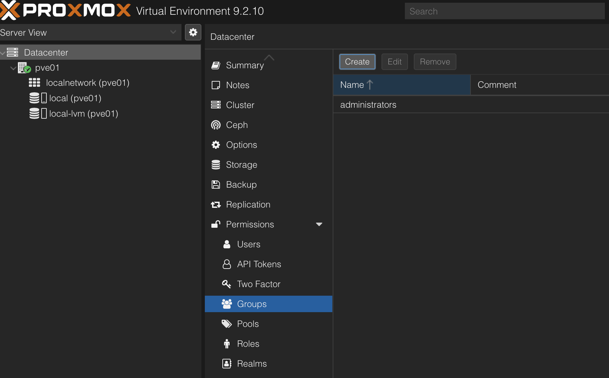

Then added a user by going to Datacenter -> Permissions -> Users -> Add. Select the group created. the realm needs to be 'proxmox VE authentication', because the user will be just for Proxmox management and does not need access to ssh to the server.

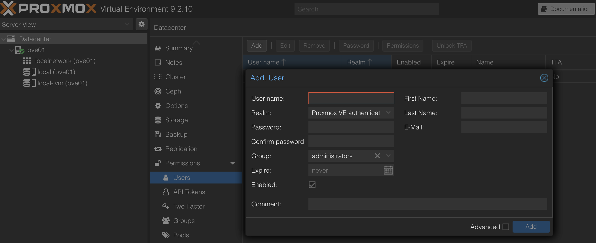

Now I added the permissions to the group by going to Datacenter -> Permissions -> Add. Selected / on path. On group selected the admin group created. On role selected the Administrator role which gives all permissions.

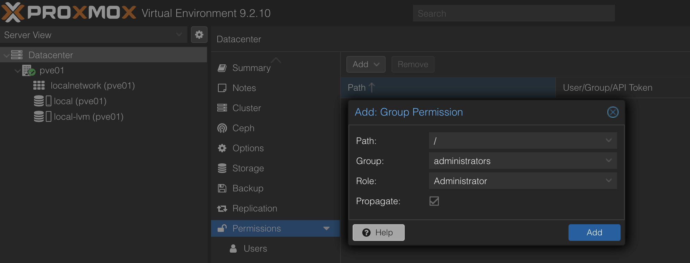

Alternatively, by script, this can be done like so, just replace the variables values:

```bash
#!/bin/bash

set -e

# Variables
USERNAME="user_a"
GROUPNAME="group_a"
PASSWORD="password_a"
REALNAME="pve"
EMAIL="someemail@provider.com"
COMMENT="Proxmox Administrator user"
FIRSTNAME="Firstname"
LASTNAME="Lastname"

# ---- Create group
pveum group add $GROUPNAME

# ---- Create User
pveum user add $USERNAME@$REALNAME --password $PASSWORD --comment "$COMMENT" --email $EMAIL --firstname $FIRSTNAME --lastname $LASTNAME --groups $GROUPNAME

# ---- Set permission
pveum acl modify / --role Administrator --group $GROUPNAME
```

Then when accessing the web UI, use the new user and password created and should have all the permissions.

## 5 - Create a terraform user and api token

When creating VMs and LXCs with Terraform, it is better to not use either the root account or any other user account, but with a technical user or service account. What this means is that a technical user or service account is a user that is not used by a person, but by some script, application, service or automation tool, on this case, Terraform.

For this I will create a new role, group, permissions and user.

To create the role, go to Datacenter -> Permissions -> Roles and click on Create button.

The list of previledges is:

- Datastore.AllocateSpace
- Datastore.Audit Pool.Allocate
- SDN.Use
- Sys.Audit
- Sys.Console
- Sys.Modify
- Sys.PowerMgmt
- VM.Allocate
- VM.Audit
- VM.Clone
- VM.Config.CDROM
- VM.Config.CPU
- VM.Config.Cloudinit
- VM.Config.Disk
- VM.Config.HWType
- VM.Config.Memory
- VM.Config.Network
- VM.Config.Options
- VM.Migrate
- VM.Monitor
- VM.PowerMgmt

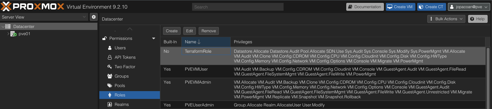

To create the group, navigate to Datacenter -> Permissions -> Groups and create the terraform group.

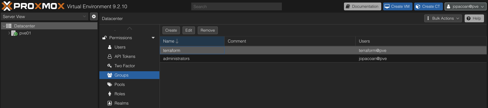

To create the permissions, go to Datacenter -> Permissions and create a new group permission entry. Select the / path, the group created and the role created.

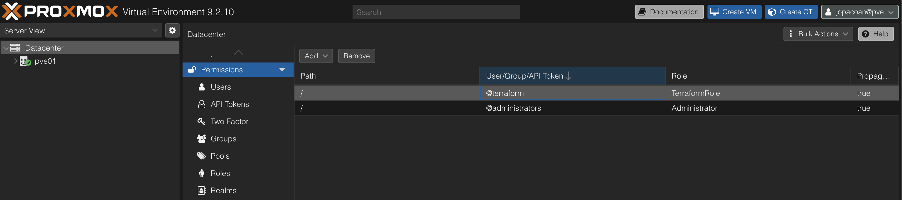

To create the user, go to Datacenter -> Permissions -> Users and create a terraform user. The realm needs to be "pve" and the group is the one created. I didn't place a password.

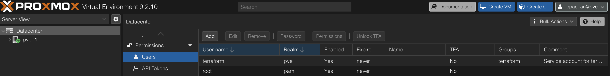

FInally it is necessary to create an API Token so it can be used by terraform. On Datacenter -> Permissions -> API Tokens, click on create button and fill the form with a token name. Copy the generated token for when it is nedded.

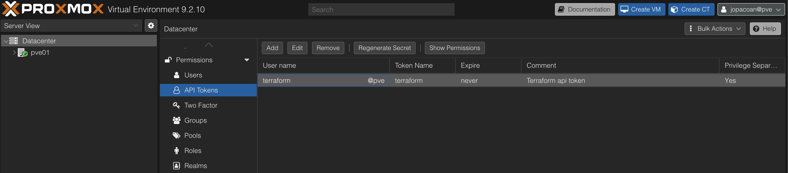

Instead of doing from web UI, it can be done via a script:

```bash
#!/bin/bash

# This script adds a role, group, user and api token to be used by terraform
set -e

# Variables
USERNAME="terraform"
GROUPNAME="terraformGroup"
ROLENAME="terraformRole"
APITOKENNAME="terraformToken"
REALNAME="pve"
COMMENT="Terraform service account"
FIRSTNAME="Terraform"
LASTNAME="Account"
PREVILEDGES="Datastore.Allocate \
Datastore.AllocateSpace \
Datastore.Audit \
Pool.Allocate \
SDN.Use \
Sys.Audit \
Sys.Console \
Sys.Modify \
Sys.PowerMgmt \
VM.Allocate \
VM.Audit \
VM.Clone \
VM.Config.CDROM \
VM.Config.Cloudinit \
VM.Config.CPU \
VM.Config.Disk \
VM.Config.HWType \
VM.Config.Memory \
VM.Config.Network \
VM.Config.Options \
VM.Console \
VM.Migrate \
VM.PowerMgmt"

# ---- Create Role
pveum role add $ROLENAME --privs "$PREVILEDGES"

# ---- Create group

pveum group add $GROUPNAME

# ---- Create User

pveum user add $USERNAME@$REALNAME --comment "$COMMENT" --firstname $FIRSTNAME --lastname $LASTNAME --groups $GROUPNAME

# ---- Set permission

pveum acl modify / --role $ROLENAME --group $GROUPNAME

# ---- Set API Token

pveum user token add $USERNAME@$REALNAME $APITOKENNAME

```

## 6 - prepare some ISOs and Templates

Before creating the VMs and LXCs, I decided to prepare some ISOs for the VMs and Templates for the LXCs.

The templates are on Node -> Local (pve) -> Templates. On the top right, click on the Templates button and import the Debian and Alpine. The Debian image will be used by the LXC that contains all the tools to manage the cluster, for example, git, argocd cli, kubectl, ansible, opentofu and others. The Alpine will be used by the LXC with the reverse proxy. I decided to go with Debian for one of them because most tools have plenty of documentation and examples online with a debian OS, so it may be easier to troubleshoot it, but I could go with either Debian or Alpine for both. I choose Alpine for the reverse proxy LXC because it is much more lightweight and since I plan on having just a reverse proxy, should be fine.

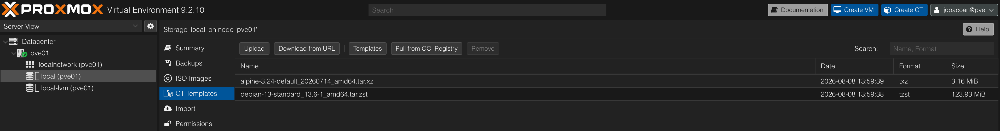

To prepare the ISOs go to Storage -> Local (pve) -> ISOs. Then click on Download from URL. I decided to download Debian as well since will be where the Kubernetes will be. I could go with Talos Linux, but I decided to go with Debian because I may want to access through ssh to the VM. The Debian download page is this one [Debian download page](https://www.debian.org/distrib/)
Click on "mirrors" and select the version desired. I decided to go with this one, just copy and paste if necessary "https://mirrors.up.pt/debian-cd/13.6.0/amd64/iso-cd/debian-13.6.0-amd64-netinst.iso".

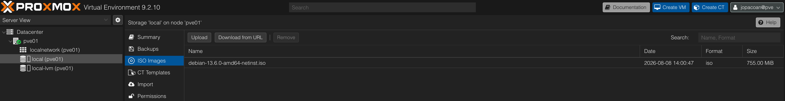

If there is the need for a script to do this, here it is:

```bash
#!/bin/bash

# This script downloads ISOs and templates to Proxmox
# The ISO is a debian and the templates are debian and alpine
set -e

# Variables
ISO_URL="https://mirrors.up.pt/debian-cd/13.6.0/amd64/iso-cd/debian-13.6.0-amd64-netinst.iso"
DEBIAN_TEMPLATE="debian-13-standard_13.6-1_amd64.tar.zst"
ALPINE_TEMPLATE="alpine-3.24-default_20260714_amd64.tar.xz"

# ---- Download templates
echo "Downloading Debian template $DEBIAN_TEMPLATE"
pveam download local $DEBIAN_TEMPLATE
echo "Downloading Alpine template $ALPINE_TEMPLATE"
pveam download local $ALPINE_TEMPLATE

# ---- Download ISO
echo "Downloading ISO from $ISO_URL"
cd /var/lib/vz/template/iso
wget $ISO_URL

pveam update
```

# What I didn't do that could have done

So, there are a few things I could have done, but because I don't have enough storage or don't have enough resources and I only have one server, I decided to simplify my use case. But here are a list of additional configurations I could have done:

## Backups

Backups are important because if something happens to the VMs, the server or the SSD, it is possible to recover the data and restore it into a new server. For example, if I had a NAS server somewhere, I could setup Proxmox to generate a full backup every day or week and send to the NAS server.

## High availability cluster

Proxmox has the ability to have HA. Meaning that if I had a cluster of at least two servers, and one server crashed, the VMs could be started on the other server. This can be done by setting up a cluster of Proxmox nodes and configuring HA. I don't have two servers, so I cannot do this.

## Dedicated storage for kubernetes persistent volumes

I only have one SSD that I can use on my server, but if I had more or a NAS server, I would create a separate storage for the kubernetes persistent volumes.

# Next steps

Now that I have Proxmox installed and configured, I can start creating the VMs and LXCs. Next step will be to create the VMs and LXCs as planned. I will use terraform and Ansible to create and configure them, although I will try to explain how to create them using the Proxmox web UI as well. Check [3 - Create and configure VMs and LXC](./3-Create_and_conf_VMs_LXC.md) for the next step.

# Articles:

Heres the full list of articles of this series:

 - [1 - Architecture and Hardware](./1-Architecture_and_hardware.md)
 - [2 - Install Proxmox](./2-Install_proxmox.md)
 - [3 - Create and configure LXC](./3-Create_and_conf_LXC.md)
 - [4 - Create and configure VMs](./4-Create_and_conf_VMs.md)