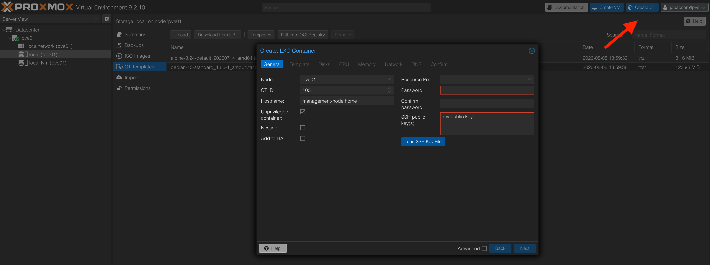
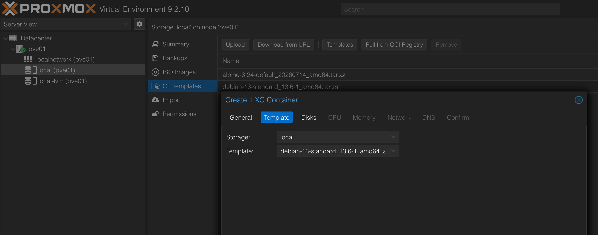
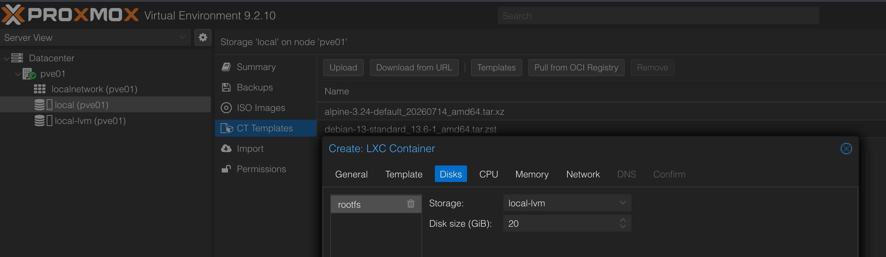
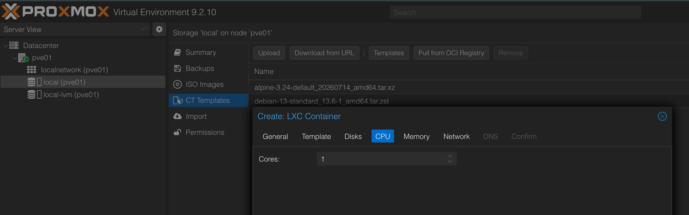
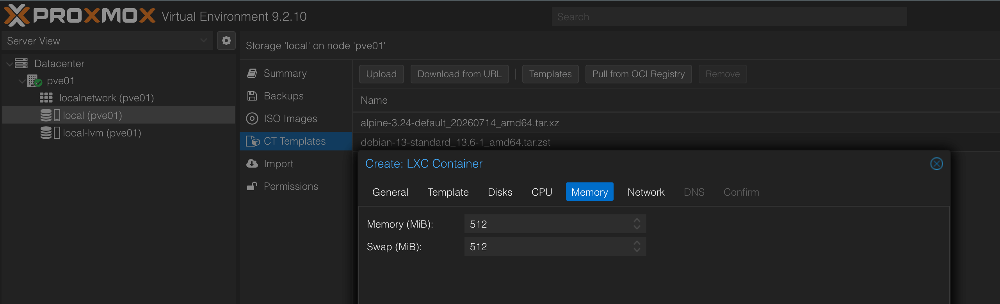
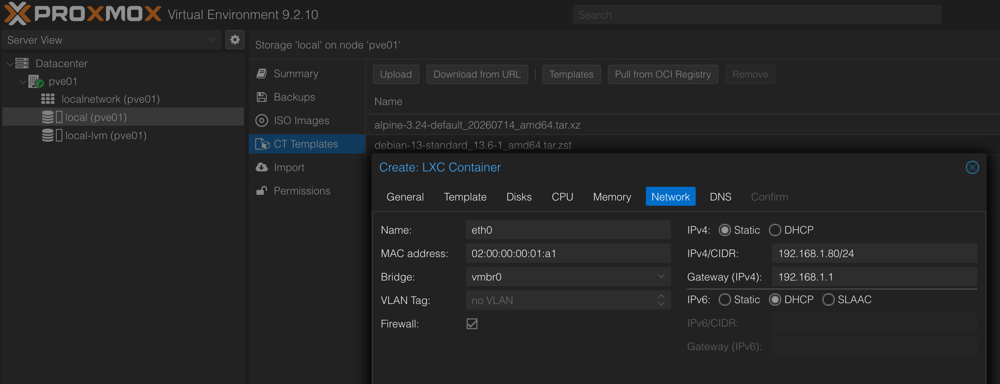
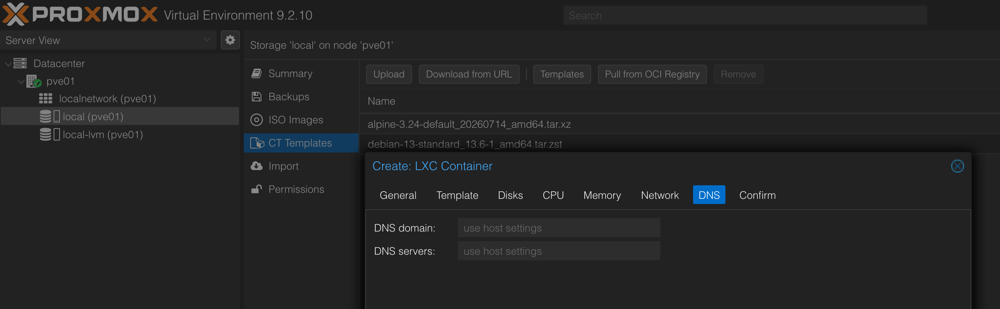
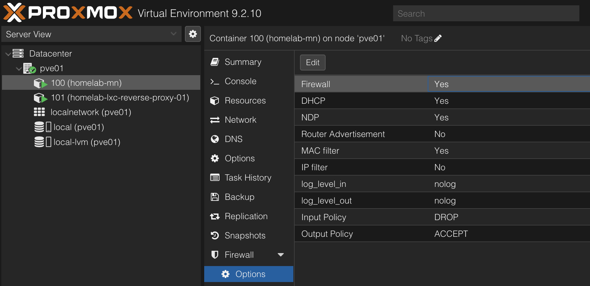
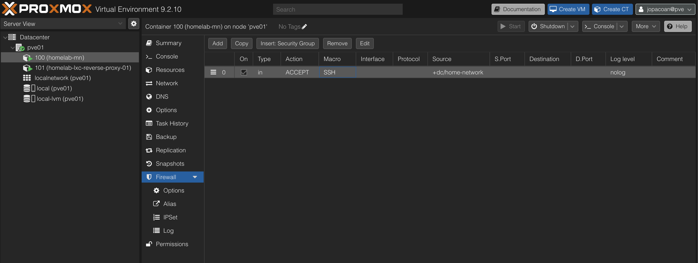

# Introduction

Now that I have Proxmox ready, I can create the VMs and LXCs as planned in the first article. The overall plan is to create 3 VMs for Kubernetes with K3s and 2 LXCs, one with a reverse proxy and the other with all the tools needed to manage everything, for example kubectl, ansible and opentofu.

Check out [first article about the architecture](./1-Architecture_and_hardware.md) for more details about the design and a high level overview of the architecture.

# Creating the first LXC

The first LXC I will deploy will be useful to manage the cluster, Proxmox and the other LXC with the reverse proxy.

There is a particularity with this LXC. This is the LXC that is going to have OpenTofu and Ansible to create and configure all the other VMs and LXC, but I cannot use it to create itself, so it needs to be created and configured either manually or through a script. I will explain both ways.

I could do it through OpenTofu and Ansible from my pc, but I want to not need any tool on my pc.

## Installing and configuring manually through web UI

### Creating the LXC

To create a LXC, select the node created and click on the Create CT on the top right. A pop up window will appear with a few tabs with settings to be configured. The Node and VM ID should be already filled, but if not, select correct node and the ID is whatever wanted.

The first tab contains the general information:

 - Node
   - The node where the LXC will be created
 - VM ID
   - The ID of the LXC, can be anything
 - Hostname
   - The hostname it should have
 - Unprivileged container
   - Normally every container should be unpreviledge, unless some specific use case, because it can give access to the host system
 - Nesting
   - Allows the LXC to create other containers, for example to virtualize or containerize something else. I didn't enable it because I do not need to do that on this LXC
 - Add to HA
   - Only necessary if you have more than one Proxmox node and want to use the High Availability feature. I only have one node, so I didn't enable it
 - Resource Pool
   - This allows to organize the resources, like VMs and LXCs into groups. This is useful for example if I had different environments, each with its own VMs and LXCs, and I wanted to easily manage each group of VMs on a specific environment. I don't need that for now.
 - Password
   - The password for the root user. Not needed if don't want to access through ssh with password
 - SSH public key
   - The public key to access to root through ssh



The next tab is Template:

Here I selected the Debian template.



Next is Disk. I set to 20 GB, like on the architecuture overview from the [first article](./1-Architecture_and_hardware.md#architecture).



Next is CPU. I set to 1 core.



Next is Memory. I set to 512 MB.



Next is Network. Here I Specified the MAC and static IP address. Again, to respect the Network values from the [first article](./1-Architecture_and_hardware.md#network).


Next is DNS. I leave as default since it will use the same as the Proxmox node.



Next confirm to create the LXC. It should appear on the left side the LXC created.

### Configuring the LXC

Before installing anything on the LXC, I enabled the firewall and created a firewall rule to allow ssh access from home network.

To do that, select the LXC, then navigate to Firewall -> Options and enable firewall.



Then go to Firewall -> Rules and add a rule to allow ssh access from home network.



It should be possible to access it through ssh only from home network, like `ssh root@[IP_of_lxc] -i <path_to_private_key>`.

To avoid placing the ip and path to the ssh private key, I edited the ssh config file `~/.ssh/config` and added the following lines:

```
host homelab-mn
  host [IP_OF_LXC]
  user root
  identityfile <path_to_private_key>
```

Now to access, I just need to type `ssh homelab-mn` on the terminal.

What I installed here was git, ansible, opentofu, kubectl and argocd cli. Here's a script to run on the LXC, or run each command manually:

```bash
#!/bin/bash

# This script configures the first LXC on Proxmox
# This uses a Debian template and will be used
# to manage and access to every other VM or LXC
set -e

# Variables
UBUNTU_CODENAME=jammy # For ansible

# Update and upgrade packages
echo "Updating and upgrading packages"
apt update -y
apt upgrade -y

echo "Installing curl"
apt install curl -y

echo "Installing gpg"
apt install gpg -y

echo "Installing git"
apt install git -y

echo "Installing kubectl"
apt install kubectl -y

echo "Installing ansible"
apt install ansible -y

# Install opentofu
# https://opentofu.org/docs/intro/install/deb/
echo "Installing opentofu"
curl --proto '=https' --tlsv1.2 -fsSL https://get.opentofu.org/install-opentofu.sh -o install-opentofu.sh
chmod +x install-opentofu.sh
./install-opentofu.sh --install-method deb
rm -f install-opentofu.sh

# Install argocd cli
# https://argo-cd.readthedocs.io/en/stable/cli_installation/#download-with-curl
echo "Installing argocd cli"
VERSION=$(curl -L -s https://raw.githubusercontent.com/argoproj/argo-cd/stable/VERSION)
curl -sSL -o argocd-linux-amd64 https://github.com/argoproj/argo-cd/releases/download/v$VERSION/argocd-linux-amd64
install -m 555 argocd-linux-amd64 /usr/local/bin/argocd
rm argocd-linux-amd64
```

## Installing and configuring with a script

To create and configure the LXC through a script, I separated the process into two scripts. One to create the LXC and another to install the tools.

Here is the script to create the LXC:
```bash
#!/bin/bash

# This script creates the first LXC on Proxmox
# This uses a Debian template and will be used
# to manage and access to every other VM or LXC
set -e

# Variables
VMID=100
HOSTNAME="homelab-mn"
TEMPLATE="local:vztmpl/debian-13-standard_13.6-1_amd64.tar.zst"
STORAGE="local-lvm"
DISK_SIZE="20"
MEMORY="512"
CORES="1"
BRIDGE="vmbr0"
MAC="02:00:00:00:01:a1"
IP="192.168.1.80/24"
GATEWAY="192.168.1.1"
PATH_TO_SSH_PUBLIC_KEY="/root/.ssh/homelab-proxmox.pub"

echo "Creating LXC."
pct create $VMID $TEMPLATE \
  --hostname $HOSTNAME \
  --storage $STORAGE \
  --rootfs $STORAGE:$DISK_SIZE \
  --memory $MEMORY \
  --cores $CORES \
  --net0 name=eth0,bridge=$BRIDGE,hwaddr=$MAC,ip=$IP,gw=$GATEWAY \
  --unprivileged 1 \
  --features nesting=0 \
  --onboot 1 \
  --ssh-public-keys $PATH_TO_SSH_PUBLIC_KEY

echo "Starting LXC."
pct start $VMID
```

Once the LXC is created and running, connect to it and execute the same script as [the previous section](#configuring-the-lxc).

# Creating and configuring the reverse proxy LXC

Now that the management LXC is created, I can use Opentofu and Ansible from that LXC to create and configure the reverse proxy LXC, and all the VMs, but more on that on the next articles.

Since I now have the management LXC, I can create everything from there. Connected to it through `ssh homelab-mn` on my terminal, just like I did on the previous section [Configuring the LXC](#configuring-the-lxc).

On there I git cloned my [repo](https://github.com/Joao-Andrade/homelab-devops), like so `git clone https://github.com/Joao-Andrade/homelab-devops.git`, because I have all the code there. The repo has tags for each article, so check for `v3` for the code of this article.

## Terraform and Ansible folder structure

Terraform is a tool used to manage the infrastructure using code, or more known as Infrastructure as Code. Ansible is used to configure the resources created by Terraform, for example the VMs and LXCs. Check the [code I created on the repo](https://github.com/Joao-Andrade/homelab-devops/tree/main/infrastructure), but the structure of the code is the following:

```bash
|-- infrastructure
|   |-- opentofu
|   |   |-- modules
|   |   |   |-- lxc
|   |   |   |   |-- main.tf
|   |   |   |   |   |-- Creates the resource LXC
|   |   |   |   |-- outputs.tf
|   |   |   |   |   |-- Which the module outputs, like IP and MAC
|   |   |   |   |-- variables.tf
|   |   |   |   |   |-- What are the variables declared for the module
|   |   |   |   |-- versions.tf
|   |   |   |   |   |-- What provider to use
|   |   |-- environments
|   |   |   |-- homelab-01
|   |   |   |   |-- main.tf
|   |   |   |   |   |-- Creates the resources for the homelab, the LXCs and VMs
|   |   |   |   |-- variables.tf
|   |   |   |   |   |-- Variables declaration
|   |   |   |   |-- outputs.tf
|   |   |   |   |   |-- Outputs shown after applying the terraform code
|   |   |   |   |-- terraform.tfvars
|   |   |   |   |   |-- Values for the variables
|   |   |   |   |-- backend.tf
|   |   |   |   |   |-- Where the state is stored
|   |   |   |   |-- providers.tf
|   |   |   |   |   |-- Where to connect
|   |   |   |   |-- versions.tf
|   |   |   |   |   |-- Terraform and providers versions
|-- ansible
|   |-- ansible.cfg
|   |   |-- Define various configurations, but I just defined the inventory and roles locations    
|   |-- inventory
|   |   |-- hosts.yaml
|   |   |   |-- Hosts where ansible will connect to
|   |-- playbooks
|   |   |-- reverse-proxy.yaml
|   |   |   |-- Playbook to run the tasks on the reverse proxy
|   |-- roles
|   |   |-- Reusable code, similar to opentofu's modules.
|-- helm-charts (later chapters)
|   |-- app1
|   |-- app2
|   |-- ....
```

The infrastucture folder contains both the Opentofu code to create the LXC and the ansible folder with the code to configure the LXC. It will also contain the helm-charts folder which will have the helm charts for the applications I install, like argocd or gitlab.

Inside the opentofu folder, there are three folders: states, modules and environments.
 - The states folder contains the state of the infrastucture. When using opentofu, for example `tofu apply`, it creates a state file to keep track of the resources that were created and what changes are on the code compared to the state file.
 - The modules folder contains the code to create a LXC and a VM.
 - The environments folder contains the code to create the resources on different environments, but since I only have one environment, it only contains the homelab-01 folder.

Inside the ansibles folder, there are three folders and a file:
 - The ansible.cfg allows to configure various configurations including the inventory and roles locations.
 - The inventory folder contains the hosts where ansible will connect to.
 - The playbooks folder contains the playbooks. A playbook is a list of tasks to execute on one or more hosts.
 - The roles folder contains reusable code, similar to opentofu's modules. For example, I just created one to update the apt cache and upgrade the packages on debian hosts.

Inside the helm-charts folder, it contains the helm charts for the applications I install, like argocd or gitlab, but that is described on the next chapters.

## Using opentofu to create the LXC

On the management LXC and the github repository cloned, check [Creating and configuring the reverse proxy LXC](#creating-and-configuring-the-reverse-proxy-lxc), navigated to the `infrastructure/opentofu/environments/homelab-01` folder. This folder has the same structure as shown in the previous section [Terraform and Ansible folder structure](#terraform-and-ansible-folder-structure). **NOTE** that the code for only what is described on this article is on tag `v3`.

The code creates three resources. The LXC, enables the LXC firewall and adds firewall rules to:
 - Allow SSH from the management LXC
 - Allow HTTP from the home network
 - Allow HTTPS from the home network

To apply these changes, I run these commands:
```bash
cd infrastructure/opentofu/environments/homelab-01
tofu init
tofu plan
tofu apply
```

The LXC should be accessible through SSH from the management LXC only. To try this, I tried to run the command on both the management and my computer:

```bash
ssh -i .ssh/homelab-management root@192.168.1.81
```

Only from the management LXC should succeed.

## Using ansible to configure the LXC

On the management LXC, after creating the second LXC with opentofu, I can use Ansible to configure the LXC. On the infrastructure folder, I have the ansible folder with the code to configure the LXC. What it does is simply installing nginx on the reverse proxy LXC. The playbook is called `reverse-proxy.yaml` and it is located in the `playbooks` folder.

Because I have the ansible.cfg with the inventory and roles locations defined, I can just run the playbook from the `infrastructure/ansible` folder.

```bash
cd infrastructure/ansible
ansible-playbook playbooks/reverse-proxy.yaml
```
From my PC, I can now open the browser and check `http://192.168.1.81` to see the default nginx page.

# Next steps

Now that I have a management LXC and already tried creating and configuring resources with Opentofu and Ansible, I can use them to create and configure the VMs that will be my kubernetes cluster. That is what I do in the next article [4 - Create and configure VMs](./4-Create_and_conf_VMs.md).

# Articles:

Heres the full list of articles of this series:

 - [1 - Architecture and Hardware](./1-Architecture_and_hardware.md)
 - [2 - Install Proxmox](./2-Install_proxmox.md)
 - [3 - Create and configure LXCs](./3-Create_and_conf_LXCs.md)
 - [4 - Create and configure VMs](./4-Create_and_conf_VMs.md)
 - [5 - Deploy and compare git servers](./5-Deploy_and_compare_git_servers.md)