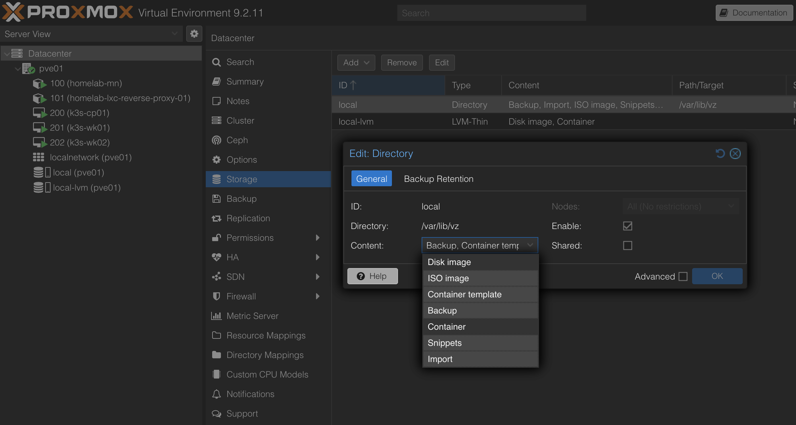

# Introduction

Now that I have the management LXC createed and configured, managed to deploy the second LXC with OpenTofu and configured it with Ansible, I can now create the three VMs that will form my Kubernetes cluster and configure them with Ansible.

Check out [first article about the architecture](./1-Architecture_and_hardware.md) for more details about the design and a high level overview of the architecture.

## Pre requisites

Before starting creating VMs it is necessary to to enable snippets on proxmox on datacenter level-storage-local. This is necessary because on OpenTofu, in order to do cloud-init configurations on the VMs, it needs to save them as snippets on the proxmox host. Navigated to Datacenter -> Storage, clicked on local and selected the Edit button. On the content section checked the Snippets (allow) box.



## Creating the VMs

The code for creating the VMs is located on my repository [Joao-Andrade/homelab-devops](https://github.com/Joao-Andrade/homelab-devops/tree/v4/infrastructure/opentofu). Check the tag `v4` for the code I've used on this article.

Regarding the differences on the code to the last article, or tag `v3`, is the following:

- Added a new module called VM. This is used to create each VM.
- Added a folder called cloud_configs. This contains re-usable cloud-config files. For this article, it is just to add an SSH public key to the debian user and enable the qemu-guest-agent.
  - Qemu-guest-agent is useful for the communication between the VM and Proxmox and also allows to do some actions like shutdown properly or freeze the filesystem for backups or snapshots.
- Added a locals.tf file on the environments/homelab-01 folder. This allows to set specific values for each VM and then the main.tf file does a loop to create each VM.
- Updated the variables.tf file on the environments/homelab-01 folder contains a new variable `proxmox_ssh_private_key_path`. This is necessary to allow OpenTofu to create snippets on Proxmox.
- Updated the providers.tf file on the infrastructure/opentofu folder to add the configuration on how to connect via SSH to Proxmox, so it allows to create snippets.
- Updated main.tf on infrastructure/opentofu folder to create the snippet with the reusable could-init configuration, create the three VMs and define firewall rules for each.
  - About the firewall rules, it allows communication between all nodes of the cluster on ports 6443/tcp for the API, 8472/udp for the flannel overlay, 10250/tcp for the kubelet API. It also opens communication from management nodes on port 6443 so I can use kubectl from there.

To apply the Opentofu code, on the Management node, cloned the repository and inside the `infrastructure/opentofu/environments/homelab-01` folder, run the following commands:

```bash
tofu init
tofu plan
tofu apply
```

It is necessary to do `tofu init` again because it needs to prepare the new VM module.

## Configuring and installing k3s on VMs

To configure the VMs and install k3s on each vm to create the Kubernetes cluster, I created some Ansible playbooks. Because the Kubernetes cluster will be formed by one control plane and two workers, I created two playbooks, `kubernetes-control-plane.yaml` and `kubernetes-workers.yaml`. The code for the playbooks are [on my repository](https://github.com/Joao-Andrade/homelab-devops/tree/v4/infrastructure/ansible/playbooks/). Check the tag `v4` for the code I've used on this article.

The differences of the ansible code to the latest article, or tag `v3`, are:

- Updated the hosts.yaml on the inventory folder to contain the VMs created using OpenTofu.
- Added two playbooks on the playbooks folder: `kubernetes-control-plane.yaml` and `kubernetes-workers.yaml`.

What each playbook does is the following:

- `kubernetes-control-plane.yaml`:
  - Execute the debian_common role, which updates and upgrades the apt repositories and installed packages.
  - Installs k3s on the control plane VM.
  - Do some verifications to check the installation.
  - Copy the kubeconfig file from the control plane VM to the local machine and update the IP address.
  - Add alias on local machine for kubectl for easy access. I defined `kc01` to be the alias to `kubectl --kubeconfig /root/.kube/homelab_cluster01`.
    - It is the `/root/` folder because it is the management node. If someone tries to follow my articles but with a different setup, it may be worth confirm the user and the path.

- `kubernetes-workers.yaml`:
  - Execute the debian_common role, which updates and upgrades the apt repositories and installed packages.
  - Installs k3s on the worker VM.
  - Do some verifications to check the installation.
  - Check if joined the cluster and it is ready.
  - Label the node as worker.

To run each playbook, on the Management node, cloned the repository and inside the `infrastructure/ansible/playbooks` folder, run the following commands:

```bash
ansible-playbook kubernetes-control-plane.yaml
ansible-playbook kubernetes-workers.yaml
```

If there is an error regarding roles or inventory, it may be because the ansible.cfg is not properly configured.

From the management node, after running the playbooks, it should be possible to do `kubectl get nodes` and see all the three nodes with the status `Ready` and the correct roles. Should output something similar to this:

```bash
# kc01 get nodes
NAME       STATUS   ROLES           AGE    VERSION
k3s-cp01   Ready    control-plane   115m   v1.36.3+k3s1
k3s-wk01   Ready    worker          111m   v1.36.3+k3s1
k3s-wk02   Ready    worker          111m   v1.36.3+k3s1
```

## Deploying a pod to test the cluster

One thing I want to do before continuing with the next steps is to deploy a simple pod just to see it running on the cluster.

For that I used helm charts. On my repository [Joao-Andrade/homelab-devops](https://github.com/Joao-Andrade/homelab-devops/tree/v4/infrastructure/helm-charts) I created a folder called `helm-charts`. For now that only contains the `simple-app` chart. That deploys a simple nginx pod and exposes it on port 80.

To deploy the pod, on the management node, cloned the repository and inside the `infrastructure/helm-charts/simple-app` folder, executed the following commands:

```bash
# Do this if not already on the folder
# cd infrastructure/helm-charts/simple-app
helm lint .

# Show the resulting kubernetes manifests after applying the templates and values
helm template . --kubeconfig ~/.kube/homelab_cluster01

# Dry-run against the cluster. Does not install anything but could show some error
helm install simple-app . --kubeconfig ~/.kube/homelab_cluster01 --dry-run=client

# Install the helm chart on the cluster
helm install simple-app . --kubeconfig ~/.kube/homelab_cluster01
```

Then the pods should be seen by doing `kubectl get pods --kubeconfig ~/.kube/homelab_cluster01`.

```bash
# kubectl get pods --kubeconfig ~/.kube/homelab_cluster01
NAME                                   READY   STATUS    RESTARTS   AGE
simple-app-simple-app-fc45bdc6-96xtk   1/1     Running   0          5m22s
simple-app-simple-app-fc45bdc6-dq4rn   1/1     Running   0          5m22s
```

Before removing the helm chart, I tried to test the simple-app service to see if it is reachable. On the management node, I port-forwarded the service:

```bash
kubectl --kubeconfig ~/.kube/homelab_cluster01 port-forward svc/simple-app-simple-app 8080:80
```

Then on another SSH access to the management node, it is possible to access the simple-app on port 8080.

```bash
curl http://localhost:8080
```

It is not possíble to do it from my computer and access on the browser because the cluster is only accessible from the management node. On the next article I will explain how I expose it through the LXC reverse proxy to access from the browser while keeping the cluster private.

After that, I uninstalled it using helm:

```bash
helm uninstall simple-app --kubeconfig ~/.kube/homelab_cluster01
```

# Next steps

Now that I have a working Kubernetes cluster, I can deploy applications to it. On the next articles I will start comparing services and check which one performs better and which one I prefer to use on my homelab. For the first service, I will compare git servers, namely Gitea and GitLab. Check the next article [5 - Deploy and compare git servers](./5-Deploy_and_compare_git_servers.md) for that.

# Articles:

Heres the full list of articles of this series:

 - [1 - Architecture and Hardware](./1-Architecture_and_hardware.md)
 - [2 - Install Proxmox](./2-Install_proxmox.md)
 - [3 - Create and configure LXCs](./3-Create_and_conf_LXCs.md)
 - [4 - Create and configure VMs](./4-Create_and_conf_VMs.md)
 - [5 - Deploy and compare git servers](./5-Deploy_and_compare_git_servers.md)