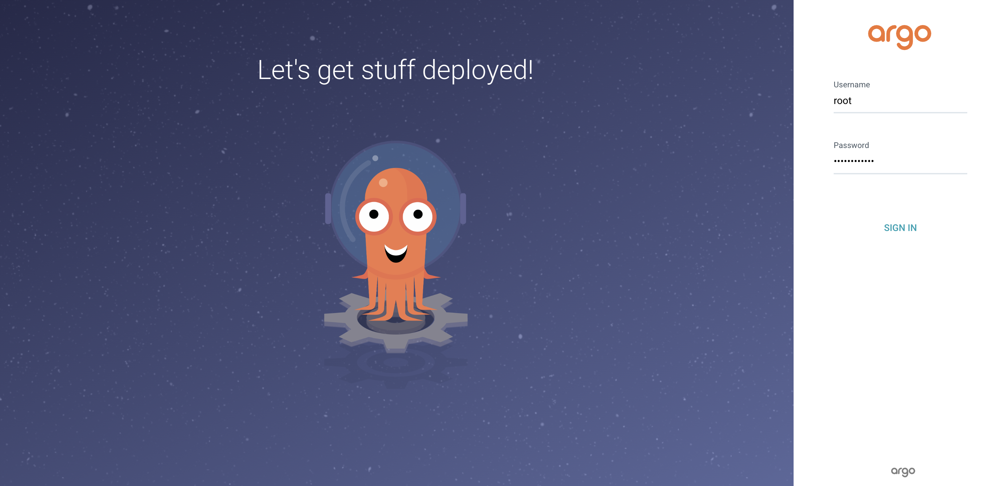
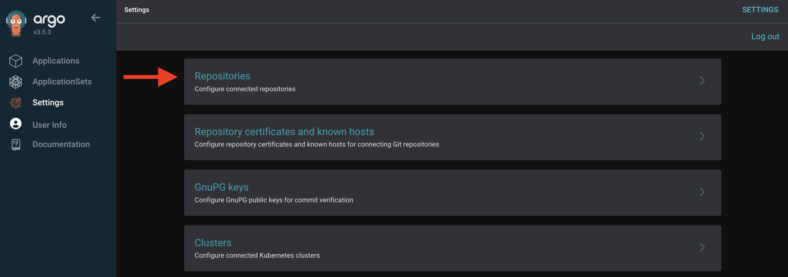
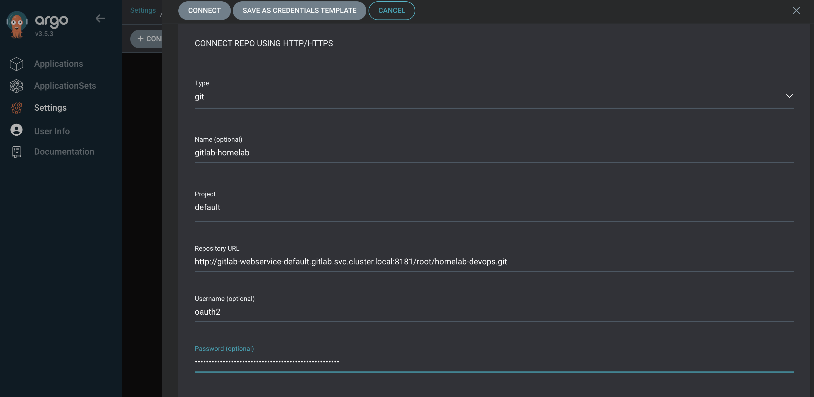
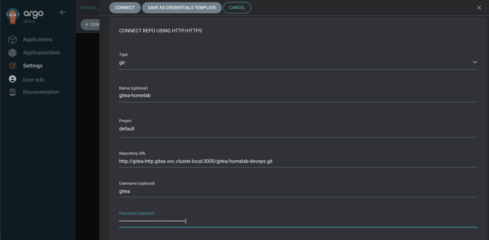
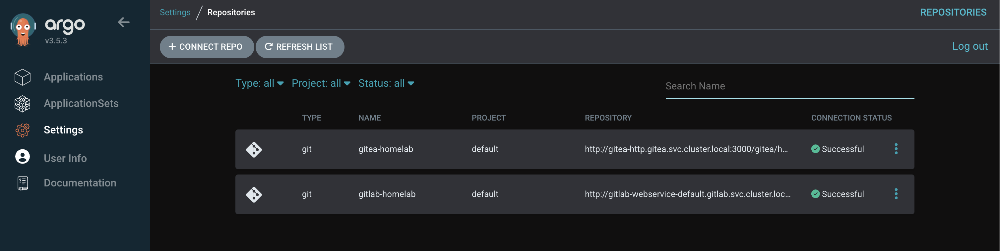
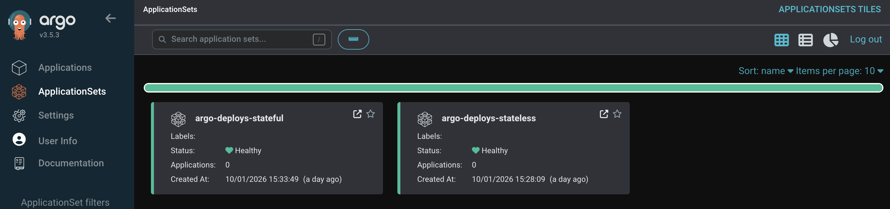
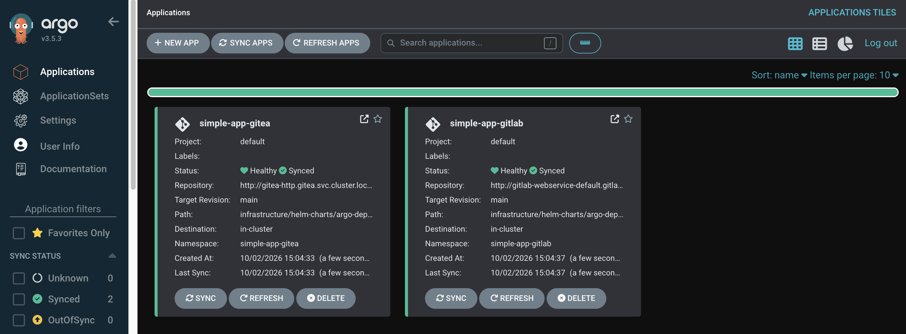

# Introduction

In the last article I installed and did a small comparison between Gitlab and Gitea. Now that I can use any of them, I can start setting up my devops workflow, and specifically my gitops workflow. In this article I will deploy ArgoCD on the kubernetes cluster and configure it to deploy applications from helm charts from both Gitea and Gitlab server, until I decide which git server to use on my homelab.

## What is ArgoCD

ArgoCD is a tool used to deploy and manage applications that are deployed on the cluster. It is a declarative tool, which means it reads the desired state of an application from a git repository and syncs the cluster to match that state. So if someone by mistake deletes or updates an application on the cluster, ArgoCD will detect that change and re-apply the desired state.

# Preparing Reverse Proxy LXC so ArgoCD is accessible

Like on the last article, where I had to expose Gitlab and Gitea through the reverse proxy, now I need to do the same for ArgoCD. To do that, I had to update the reverse proxy configuration to add a new path for ArgoCD (Check [3-Create and configure LXCs](3-Create_and_conf_LXCs.md#creating-and-configuring-the-reverse-proxy-lxc) where I installed and configured a reverse proxy on a LXC container on Proxmox, in order to have a single entry point to all my services).

In the last article, I created an Ansible playbook `update-reverse-proxy-config.yaml` on [infrastructure/ansible/playbooks/ of my homelab repository](https://github.com/Joao-Andrade/homelab-devops/tree/v6/infrastructure/ansible/playbooks/update-reverse-proxy-config.yaml) that basically updates the reverse proxy configuration. Now I updated the configuration to add the argo path to the reverse proxy config.

From the management-node, with the repository cloned, the playbook can be executed with:

```bash
# cd into infrastructure/ansible/playbooks
ansible-playbook update-reverse-proxy-config.yaml
```

Note that ArgoCD is only accessible once it is deployed on the cluster.

The URL to access from the browser is:
 - http://argocd.internal
 
On the computer that will access from the browser, I needed to edit the `/etc/hosts` file to add the following line or append it to the existing line:
 
```bash
192.168.1.81 argocd.internal
```

The ip is the reverse proxy ip. Check [Network section of first article](1-Architecture_and_hardware.md#network) for details on the homelab network.

# Deploying ArgoCD

In this section I will go through the process of deploying ArgoCD on my kubernetes cluster.

ArgoCD has [official documentation](https://github.com/argoproj/argo-helm/tree/main/charts/argo-cd) on how to deploy using Helm. I created a custom helm chart, based on the official one, which can be found on [my homelab repository](https://github.com/Joao-Andrade/homelab-devops/tree/v6/infrastructure/helm-charts/continuous-deployment/argocd).

ArgoCD has some features that I will not make use of on my homelab, so I decided to disable them on the values file, so it consumes a bit less resources. What I disabled was:

- Dex SSO
  - I don't need SSO for now, but when I have the homelab fully set up, maybe I will enable it.
- Notifications
  - I don't need notifications yet.
- HA Redis
  - If I had multiple servers, maybe I would set HA.

To deploy ArgoCD on the cluster, on the management-node, with the repository cloned, I used the following command:

```bash
helm install argocd ./infrastructure/helm-charts/continuous-deployment/argocd --kubeconfig "/root/.kube/homelab_cluster01" --namespace argocd --create-namespace --wait
```

After deploying, the initial admin password can be retrieved with:

```bash
kubectl --kubeconfig ~/.kube/homelab_cluster01 -n argocd get secret argocd-initial-admin-secret -o jsonpath="{.data.password}" | base64 -d
```

Accessed the web UI through `http://argocd.internal` and logged in with the password from the previous command.



It is possible to update the password on the web UI and afterwards remove the secret from the cluster:

```bash
kubectl --kubeconfig ~/.kube/homelab_cluster01 -n argocd delete secret argocd-initial-admin-secret
```

# Configuring ArgoCD

Now that ArgoCD is installed, I can configure it so it gets ready to deploy applications from the git repositories to the kubernetes cluster.

The steps I will take on this section are:

 - Setting up Gitea and Gitlab repositories
 - Configure the git repositories on ArgoCD

## Setting up Gitea and Gitlab repositories

Before configuring ArgoCD, I need to have Gitea and or Gitlab with a repository that contains the helm charts I want to deploy on the cluster. Each application I develop in the future will have its own repository but for now I just copy my [homelab-devops repository](https://github.com/Joao-Andrade/homelab-devops) to Gitea and Gitlab and then use ArgoCD to deploy a simple app from a helm chart that is on it, since it follows the same pattern of deployment as the other applications deployed so far (a helm chart based on an official one).

To do that, I just created a repository called `homelab-devops` on both gitlab and gitea and copied the contents of my repository on Github to each.

## Configure ArgoCD repositories

The first thing to do on ArgoCD is to set up a repository connection. To do that, go to Settings -> Repositories and click on "+ Connect Repo".



On the dialog that opens, it is possible to configure the connection settings. Selected to connect via HTTP/HTTPS. Note that I used a personal access token. Check [previous chapter](./5-Git_gitlab_vs_gitea.md#getting-gitlab-and-gitea-access-tokens) to know how to create a token on Gitea or Gitlab.

For the URLs, I used the kubernetes services url since ArgoCD is inside the cluster. To check the url of the services, from the management-node:

```bash
kubectl --kubeconfig ~/.kube/homelab_cluster01 -n gitea get svc -o wide
kubectl --kubeconfig ~/.kube/homelab_cluster01 -n gitlab get svc -o wide
```

So, for Gitlab, these are the important settings I used:

- Connect via: `HTTP/HTTPS`
- Repository URL: `http://gitlab-webservice-default.gitlab.svc.cluster.local:8181/root/homelab-devops.git`
- Username: `oauth2`
- Password: `<Personal Access Token>`



For Gitea:

- Connect via: `HTTP/HTTPS`
- Repository URL: `http://gitea-http.gitea.svc.cluster.local:3000/gitea/homelab-devops.git`
- Username: `gitea`
- Password: `<Personal Access Token>`



When both repositories are connected, it should be visible on the Repositories list that the connection to both are successful.



## Configure ArgoCD Application Sets

ArgoCD has the feature to configure ApplicationSets, which allows defining a set of applications that will be deployed from a git repository. This allows deploying multiple applications with just one configuration instead of defining an ArgoCD Application for each deployment I want. For my homelab I created two ApplicationSets, one for stateful applications and another for stateless applications.

 - Stateless applications
   - These applications can be deleted and recreated without risk of losing any data. So there is no harm if I delete the application from git by mistake and ArgoCD then deletes it from the cluster. For example, applications that do not rely on persistent volumes.

- Stateful applications
   - These applications should not be deleted if I remove the application folder from git by mistake, for example a database that needs to keep its data on a persistent volume. Meaning that if there is a mistake and for some reason I remove the ArgoCD application, the resources still remain on the cluster. The catch is that if I actually want to remove the resources, besides deleting the folder from git, so ArgoCD stops tracking it, I need to remove all the resources by hand from the cluster.
   
In order to have that, I created a folder on the [homelab repository](https://github.com/Joao-Andrade/homelab-devops/tree/v6/infrastructure/argo-configs) `infrastructure/argo-configs` that contain the application sets configurations. The stateful application set reads all the folders under `infrastructure/helm-charts/argo-deploys/stateful` and the stateless application set reads all folders under `infrastructure/helm-charts/argo-deploys/stateless`.

Because I currently have two git servers, Gitea and Gitlab, I decided to have each ApplicationSet read from each git server. This is unnecessary, but since I am using both for now, why not use both git servers. So for the stateful applications, I set the Gitlab repository, and for the stateless applications, I set the Gitea repositories.

Inside each folder, all I need to do is create the helm-charts that I want to deploy on the cluster, and then ArgoCD will sync and create the ArgoCD Applications to deploy, or remove, the respective resources from the cluster.

To make it work, I just need to apply the Application Sets manifests on the cluster, so from the `management-node`, with the repository cloned, I can just do the following commands:

```bash
cd infrastructure/argo-configs
kubectl apply -f applicationset-stateless.yaml -n argocd --kubeconfig ~/.kube/homelab_cluster01
kubectl apply -f applicationset-stateful.yaml -n argocd --kubeconfig ~/.kube/homelab_cluster01
```

Then on ArgoCD, on ApplicationSets menu it should be visible.



## Deploying a simple application with ApplicationSets

To confirm that all of this works, I decided to test it by deploying a simple application with ApplicationSets. In a previous chapter [4-Create_and_conf_VMs#deploying-a-pod-to-test-the-cluster](./4-Create_and_conf_VMs.md#deploying-a-pod-to-test-the-cluster) I had deployed a simple app with helm charts, so I will re-use it. I copied the folder [simple-app](https://github.com/Joao-Andrade/homelab-devops/tree/v6/infrastructure/helm-charts/simple-app) to [simple-app-gitea](https://github.com/Joao-Andrade/homelab-devops/tree/v6/infrastructure/helm-charts/argo-deploys/stateless/test/simple-app-gitea) and [simple-app-gitlab](https://github.com/Joao-Andrade/homelab-devops/tree/v6/infrastructure/helm-charts/argo-deploys/stateful/test/simple-app-gitlab). Note that, because I am using a repository from Gitea for the stateless and a repository from Gitlab for the stateful, I need to copy the folder to the respective repository. This will make it so both stateful and stateless application sets will deploy the simple app, although on different namespaces.

Checked on ArgoCD that both applications are deployed.



It is also visible on the cluster. On the `management-node` server:

```bash
kubectl get pods -A --kubeconfig ~/.kube/homelab_cluster01
```

It should show the pods running and each on their namespace.

## Removing the simple application

To remove both applications created on the previous section, just remove the respective folder with the helm chart from each git server. Then ArgoCD will sync and remove the applications from the applications list (It can take a few minutes, depends on the frequency of the sync).

There is a catch though. In a previous section [Configure ArgoCD Application Sets](#configure-argocd-application-sets) I mentioned that only the stateless applications have all their resources deleted from the cluster, but the stateful applications are not automatically deleted. That means that, although it is removed from ArgoCD, the pods, pvcs or whatever other resources created on the cluster are still on the cluster and need to be manually removed.

For this simple application, it just deploys a pod, so I can just delete the namespace `kubectl delete namespace simple-app-gitlab --kubeconfig ~/.kube/homelab_cluster01` and it will delete them. As for the one deployed with the stateless application set, it is not necessary to do anything, but confirm the cluster does not have the pods:

```bash
kubectl get pods -A --kubeconfig ~/.kube/homelab_cluster01
```

## Cleaning ArgoCD

To remove ArgoCD and all resources from the cluster, there are a few steps needed:

- First remove the helm chart:
  - `helm uninstall argocd --kubeconfig ~/.kube/homelab_cluster01 --namespace argocd --wait`

- Remove remaining resources:
  - `kubectl --kubeconfig ~/.kube/homelab_cluster01 -n argocd get secrets,pvc,configmaps -o name | grep -v 'kube-root-ca.crt$' | while read -r r; do kubectl --kubeconfig ~/.kube/homelab_cluster01 -n argocd delete "$r" --wait=false; done`

- Delete resources with ArgoCD CustomResourceDefinitions
  - `kubectl --kubeconfig ~/.kube/homelab_cluster01 get applications.argoproj.io,appprojects.argoproj.io,applicationsets.argoproj.io -A | while read -r r; do kubectl --kubeconfig ~/.kube/homelab_cluster01 delete "$r" --wait=false -n argocd; done`
  - **If on another namespace, change the `-n argocd` part of the command, or remove the resources manually**.

- Confirm there is no remaining resources that the helm cannot remove:
  - `kubectl --kubeconfig ~/.kube/homelab_cluster01 -n argocd get secrets,pvc,pv,configMaps --no-headers`
  - `kubectl --kubeconfig ~/.kube/homelab_cluster01 get applications.argoproj.io,appprojects.argoproj.io,applicationsets.argoproj.io -A`
  - **Delete resources manually if there is something related to argocd**.

- Delete ArgoCD CustomResourceDefinitions
  - `kubectl --kubeconfig ~/.kube/homelab_cluster01 delete crd applications.argoproj.io applicationsets.argoproj.io appprojects.argoproj.io`

- Remove namespace
  - `kubectl --kubeconfig ~/.kube/homelab_cluster01 delete namespace argocd`

# Next steps

Now that I have ArgoCD installed, I can start using it to deploy applications from the git repositories to the kubernetes cluster. On the next article I will compare some secret managers, specifically Hashicorp Vault and OpenBao. Check the next article [7 - Secrets: Vault vs OpenBao](./7-Secrets_vault_vs_openbao.md).

# Articles

Here's the full list of articles of this series:

 - [1 - Architecture and Hardware](./1-Architecture_and_hardware.md)
 - [2 - Install Proxmox](./2-Install_proxmox.md)
 - [3 - Create and configure LXCs](./3-Create_and_conf_LXCs.md)
 - [4 - Create and configure VMs](./4-Create_and_conf_VMs.md)
 - [5 - Git: Gitlab vs Gitea](./5-Git_gitlab_vs_gitea.md)
 - [6 - Deploy ArgoCD](./6-Deploy_argocd.md)
 - [7 - Secrets: Vault vs OpenBao](./7-Secrets_vault_vs_openbao.md)
